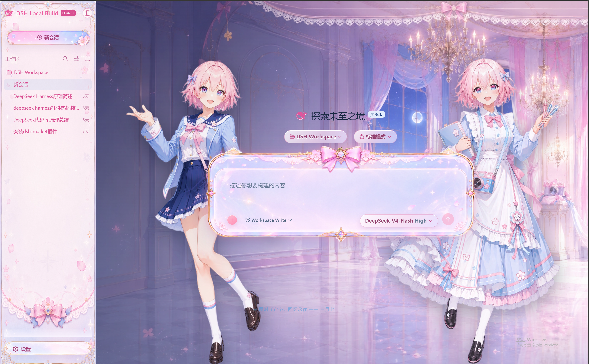
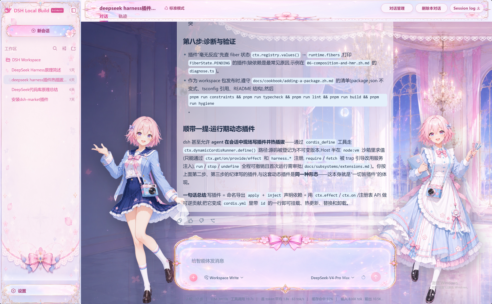
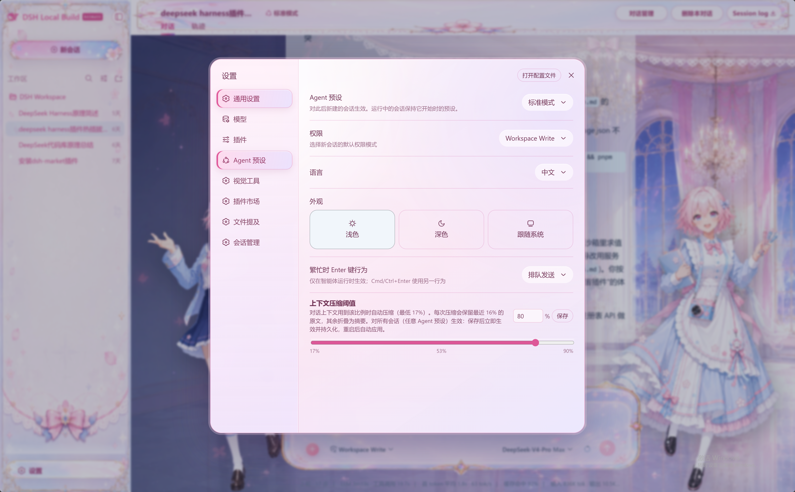

# dsh-march7th-skin · 星穹铁道三月七皮肤

简体中文 | [English](docs/README.en.md) | [更新日志](docs/CHANGELOG.md)

DeepSeek Harness Web GUI 的独立可插拔 **三月七(《崩坏:星穹铁道》)** 皮肤。标准 bundle 层插件:加入 web profile 即自动挂载,无需改动 web-app 源码或前端 dist。`apply()` 通过 `theme` 服务的覆盖层把语义 alias token 替换为三月七蓝粉配色(明暗两套),由插件自己的 node 半部分在 `/skins/march7th/*` 提供对话背景、侧栏、设置页头、输入卡片与两侧角色立绘,并重设对话滚动容器避免输入框遮挡消息。effect 销毁器还原 token 覆盖层、样式表、body 门控属性与滚动容器改造;不注入服务、不发出 Cordis 事件、不触达模型请求。

## 效果预览

点击图片可查看完整尺寸。

| 主页面 | 对话页面 | 弹出框效果 |
|---|---|---|
| [](docs/preview/main.png) | [](docs/preview/dialog.png) | [](docs/preview/settings.png) |

## 特性

- 三月七蓝粉配色覆盖明暗两套主题(经 `theme` 服务覆盖层)
- 对话背景、侧栏、设置页头、输入卡片与两侧角色立绘,图片随包携带在 `assets/`
- 重设对话滚动容器,输入框不再遮挡正在阅读的消息
- 干净卸载:插件挂载的每一份样式与属性都由它自己持有,销毁时全部还原

## 安装

以下两种方式都直接从 GitHub 在线安装。

### 使用 npx

适用于通过 npm 临时运行 DeepSeek Harness 的用户。插件管理内部会调用 `pnpm`，
请先确认 `pnpm --version` 能正常执行。

```sh
# 安装
npx --yes @deepseek-ai/dsh@latest plugin --profile web add "github:fishfromsky/dsh-march7th-skin"

# 启动或重启 Web
npx --yes @deepseek-ai/dsh@latest web

# 更新
npx --yes @deepseek-ai/dsh@latest plugin --profile web update dsh-march7th-skin --latest

# 卸载
npx --yes @deepseek-ai/dsh@latest plugin --profile web remove dsh-march7th-skin
```

`npx` 只临时运行 CLI；profile 和插件仍会保存在 `$DSH_HOME/profiles/web`（默认
`~/.dsh/profiles/web`）。安装和启动时应使用相同的 `DSH_HOME`。

### 从 deepseek-harness 源码运行

在 `deepseek-harness` 仓库根目录中执行：

```sh
# 安装
pnpm dsh plugin --profile web add "github:fishfromsky/dsh-march7th-skin"

# 启动或重启 Web
pnpm dsh web

# 更新
pnpm dsh plugin --profile web update dsh-march7th-skin --latest

# 卸载
pnpm dsh plugin --profile web remove dsh-march7th-skin
```

DSH CLI 会自动下载插件、写入 web profile 的依赖，并将其加入
`dsh.profile.bundles`。

插件的 `dsh.bundle.patch` 指向自带的 `cordis.patch.yml`，会自动向组合后的
profile 插入 `march7th-skin` 行；无需手动修改 profile 的 `package.json` 或
`cordis.patch.yml`。

## 素材来源与许可

源代码以 **MIT**（见 `LICENSE`）发布。`assets/` 中的图片不在 MIT 授权范围内：
它们是取自《崩坏：星穹铁道》© miHoYo / HoYoverse 的二次创作素材，仅用于个人、
非商业用途；商业分发需另行取得版权方授权。本项目与 miHoYo / HoYoverse 无关联，
也未获得其官方认可。

## 开发与构建

```sh
pnpm install        # 从 registry 安装开发依赖
pnpm run build      # esbuild:lib/index.js(宿主 ESM)+ lib/client.js(单文件客户端 bundle)
pnpm run test       # 基于 node:test、针对已构建 lib/ 的测试套件
pnpm run check      # 类型检查 + 构建 + 测试
pnpm run dev:sync   # 把 lib/ 与资源推入运行中的 profile 安装目录,热更新无需重启
```

宿主半部分(`src/index.ts`)的改动在下次 `dsh web` 重启后生效;客户端与资源的改动
可通过 `dev:sync` 热应用。

## 发布

```sh
pnpm install --frozen-lockfile
pnpm run check
pnpm run publish:dry-run # 检查 registry 发布清单，不实际上传
pnpm publish             # 确认版本号、更新日志和账号权限后执行
```

`prepack` 会在发布前自动执行完整检查。发布包只包含运行文件、许可说明、
英文文档和预览图，不包含源码、测试或开发脚本。

## 验证

在 `dsh web` 运行状态下:

- `GET /skins/march7th/background.webp` → `200 image/webp`
- `GET /plugins/dsh-march7th-skin/client.js` → `200`(浏览器 bundle)
- GUI 呈现皮肤;`window.__DSH_BOOT__` 的条目中包含 `dsh-march7th-skin`,且
  `inject: ["@deepseek-ai/dsh-client-ui-theme"]`

## 已知限制

- 皮肤配色是固定的,没有设置界面。
- 资产路由只接受 `GET`/`HEAD`(其他方法返回 405),且只提供随包资源类型
  (`.webp` → `image/webp`,其余为 `application/octet-stream`)。

## 许可

代码 MIT；图片素材不在 MIT 授权范围内，仅限个人非商业使用。见 `LICENSE`。
