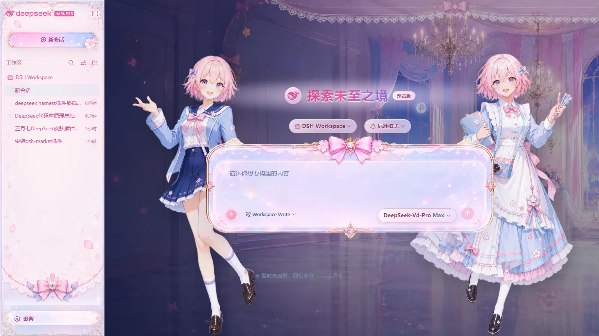

# dsh-march7th-skin · 星穹铁道三月七皮肤

简体中文 | [English](README.en.md)

DeepSeek Harness Web GUI 的独立可插拔 **三月七(《崩坏:星穹铁道》)** 皮肤。标准 bundle 层插件:加入 web profile 即自动挂载,无需改动 web-app 源码或前端 dist。`apply()` 通过 `theme` 服务的覆盖层把语义 alias token 替换为三月七蓝粉配色(明暗两套),由插件自己的 node 半部分在 `/skins/march7th/*` 提供对话背景、侧栏、设置页头、输入卡片与两侧角色立绘,并重设对话滚动容器避免输入框遮挡消息。effect 销毁器还原 token 覆盖层、样式表、body 门控属性与滚动容器改造;不注入服务、不发出 Cordis 事件、不触达模型请求。

## 效果预览

点击图片可查看完整尺寸。

| 亮色模式 | 暗色模式 |
|---|---|
| [](preview/light.webp) | [](preview/dark.webp) |

## 特性

- 三月七蓝粉配色覆盖明暗两套主题(经 `theme` 服务覆盖层)
- 对话背景、侧栏、设置页头、输入卡片与两侧角色立绘,图片随包携带在 `assets/`
- 重设对话滚动容器,输入框不再遮挡正在阅读的消息
- 干净卸载:插件挂载的每一份样式与属性都由它自己持有,销毁时全部还原

## 安装

与任何 dsh profile bundle 一样安装,两种方式:

1. **插件 CLI**(发布到 registry 之后):

   ```sh
   dsh plugin --profile web add dsh-march7th-skin
   ```

2. **Tarball**——把 `dsh-march7th-skin-<version>.tgz` 复制到 profile 目录(默认
   `$DSH_HOME/profiles/web`),然后编辑 profile 的 `package.json`:

   ```json
   {
     "dsh": {
       "profile": {
         "bundles": ["@deepseek-ai/dsh-base", "@deepseek-ai/dsh-web-app", "dsh-march7th-skin"]
       }
     },
     "dependencies": {
       "dsh-march7th-skin": "file:dsh-march7th-skin-0.2.0.tgz"
     }
   }
   ```

   随后在 profile 目录执行 `pnpm install` 并重启 `dsh web`。

行注册完全自动:包的 `dsh.bundle.patch` 指向自带的 `cordis.patch.yml`,它会向组合后的
profile 插入 `march7th-skin` 行;profile 自己的 `cordis.patch.yml` 无需提及它。

加载即生效、卸载即复原:从 profile 的 `dsh.profile.bundles` 与 `dependencies` 移除本包、
`pnpm install` 并重启,原貌即完全恢复。

## 素材来源与许可

代码以 **MIT**(见 `LICENSE`)发布。`assets/` 中的图片是取自《崩坏:星穹铁道》
© miHoYo / HoYoverse 的二次创作素材,仅用于个人、非商业用途;商业分发需另行取得
版权方授权。

## 开发与构建

需要在包旁边有一份 `deepseek-harness` 检出(devDependencies 是指向它的 `link:` 路径)。

```sh
pnpm install        # 安装开发链接
pnpm run build      # esbuild:lib/index.js(宿主 ESM)+ lib/client.js(单文件客户端 bundle)
pnpm run test       # 基于 node:test、针对已构建 lib/ 的测试套件(无额外开发依赖)
pnpm run check      # 构建 + 测试
pnpm run dev:sync   # 把 lib/ 与资源推入运行中的 profile 安装目录,热更新无需重启
```

宿主半部分(`src/index.ts`)的改动在下次 `dsh web` 重启后生效;客户端与资源的改动
可通过 `dev:sync` 热应用。

## 验证

在 `dsh web` 运行状态下:

- `GET /skins/march7th/background.webp` → `200 image/webp`
- `GET /plugins/dsh-march7th-skin/client.js` → `200`(浏览器 bundle)
- GUI 呈现皮肤;`window.__DSH_BOOT__` 的条目中包含 `dsh-march7th-skin`,且
  `inject: ["@deepseek-ai/dsh-client-ui-theme"]`

## 已知限制

- 皮肤配色是固定的,没有设置界面。
- 资产路由只接受 `GET`/`HEAD`(其他方法返回 405),且只提供随包资源类型
  (`.webp` → `image/webp`,其余为 `application/octet-stream`)。

## 许可

代码 MIT;素材为《崩坏:星穹铁道》© miHoYo / HoYoverse 的二创,仅限个人非商业使用。
见 `LICENSE`。
