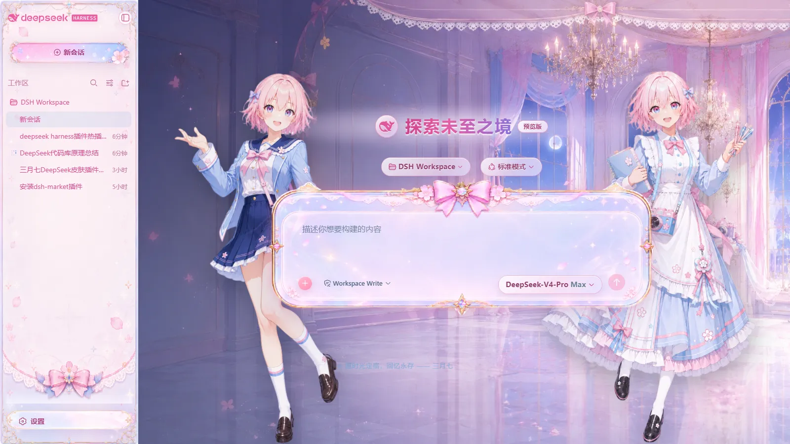

# dsh-march7th-skin · Honkai: Star Rail March 7th skin

[简体中文](../README.md) | English | [Changelog](CHANGELOG.md)

A standalone, pluggable **March 7th (Honkai: Star Rail)** skin for the dsh web GUI.
It is a normal [DeepSeek Harness](https://github.com/deepseek-ai/deepseek-harness)
bundle-layer plugin: add it to a web profile and it mounts itself — no web-app
source or dist wiring required. `apply()` overrides the web GUI's semantic alias
tokens with a March 7th blue-pink palette (light and dark schemes) through the
`theme` service's override layer, serves the conversation background, sidebar,
settings header, input card, and flanking character art from its own node half
under `/skins/march7th/*`, and reparents the transcript scrollport so the
composer never overlaps messages. The effect disposer reverts the token layer,
the stylesheet, the body gate attribute, and the scrollport promotion; it injects
no services, emits no Cordis events, and never touches a model request.

## Preview

Click an image to view it at full size.

| Light mode | Dark mode |
|---|---|
| [](preview/light.webp) | [](preview/dark.webp) |

## Features

- March 7th blue-pink palette across both light and dark schemes (via the
  `theme` service's override layer)
- Conversation background, sidebar, settings header, input card, and flanking
  character art, every image shipped in `assets/`
- Transcript scrollport reparented so the composer never overlaps messages
- Clean unload: the plugin owns every style and attribute it mounts and reverts
  them all on disposal

## Install

Both options below install the plugin directly from GitHub.

### Using npx

Use this option when running DeepSeek Harness temporarily through npm. Plugin
management invokes `pnpm` internally, so verify that `pnpm --version` works
first.

```sh
# Install
npx --yes @deepseek-ai/dsh@latest plugin --profile web add "github:fishfromsky/dsh-march7th-skin"

# Start or restart Web
npx --yes @deepseek-ai/dsh@latest web

# Update
npx --yes @deepseek-ai/dsh@latest plugin --profile web update dsh-march7th-skin --latest

# Uninstall
npx --yes @deepseek-ai/dsh@latest plugin --profile web remove dsh-march7th-skin
```

`npx` only runs the CLI temporarily; profiles and plugins remain under
`$DSH_HOME/profiles/web` (`~/.dsh/profiles/web` by default). Use the same
`DSH_HOME` when installing and starting the profile.

### Running from the deepseek-harness source checkout

Run these commands from the `deepseek-harness` repository root:

```sh
# Install
pnpm dsh plugin --profile web add "github:fishfromsky/dsh-march7th-skin"

# Start or restart Web
pnpm dsh web

# Update
pnpm dsh plugin --profile web update dsh-march7th-skin --latest

# Uninstall
pnpm dsh plugin --profile web remove dsh-march7th-skin
```

The DSH CLI downloads the plugin, records it as a web-profile dependency, and
adds it to `dsh.profile.bundles`.

The package's `dsh.bundle.patch` points to its bundled `cordis.patch.yml`, which
inserts the `march7th-skin` row automatically. There is no need to edit the
profile's `package.json` or `cordis.patch.yml` manually.

## License and assets

The source code is released under **MIT** (see [`LICENSE`](../LICENSE)). The image
assets in `assets/` are excluded from the MIT license. They are edited fan material
derived from *Honkai: Star Rail* © miHoYo / HoYoverse and are included for personal,
non-commercial use only; commercial redistribution requires the right holder's
permission. This project is unaffiliated with and is not endorsed by miHoYo or
HoYoverse.

## Development

```sh
pnpm install        # install development dependencies from the registry
pnpm run build      # esbuild: lib/index.js (host ESM) + lib/client.js (single-file client bundle)
pnpm run test       # node:test suite over the built lib/
pnpm run check      # typecheck + build + test
pnpm run dev:sync   # push lib/ + assets into the live profile install for hot reload (no restart)
```

Host-half changes (`src/index.ts`) take effect on the next `dsh web` restart;
client-half and asset changes hot-apply through `dev:sync`.

## Release

```sh
pnpm install --frozen-lockfile
pnpm run check
pnpm run publish:dry-run # validates the registry payload without uploading it
pnpm publish             # run after checking the version, changelog, and account access
```

The `prepack` hook runs the complete check automatically before publishing. The
package contains only runtime files, license information, English
documentation, and preview images—not source, tests, or development scripts.

## Verify

With `dsh web` running:

- `GET /skins/march7th/background.webp` → `200 image/webp`
- `GET /plugins/dsh-march7th-skin/client.js` → `200` (the browser bundle)
- The GUI shows the skin; `window.__DSH_BOOT__` lists `dsh-march7th-skin` among its
  entries with `inject: ["@deepseek-ai/dsh-client-ui-theme"]`

## Known limitations

- The skin's palette is fixed; there is no settings UI.
- The asset route serves only `GET`/`HEAD` (405 otherwise) and only the shipped
  asset types (`.webp` → `image/webp`, everything else `application/octet-stream`).

## License

Code is MIT; image assets are excluded from MIT and are for personal,
non-commercial use only. See [`LICENSE`](../LICENSE).
